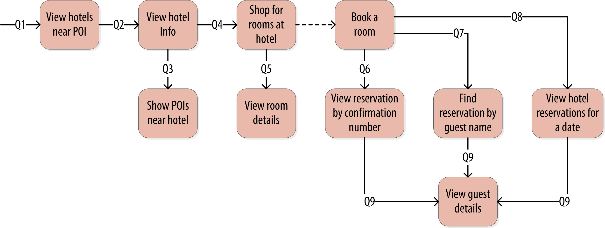
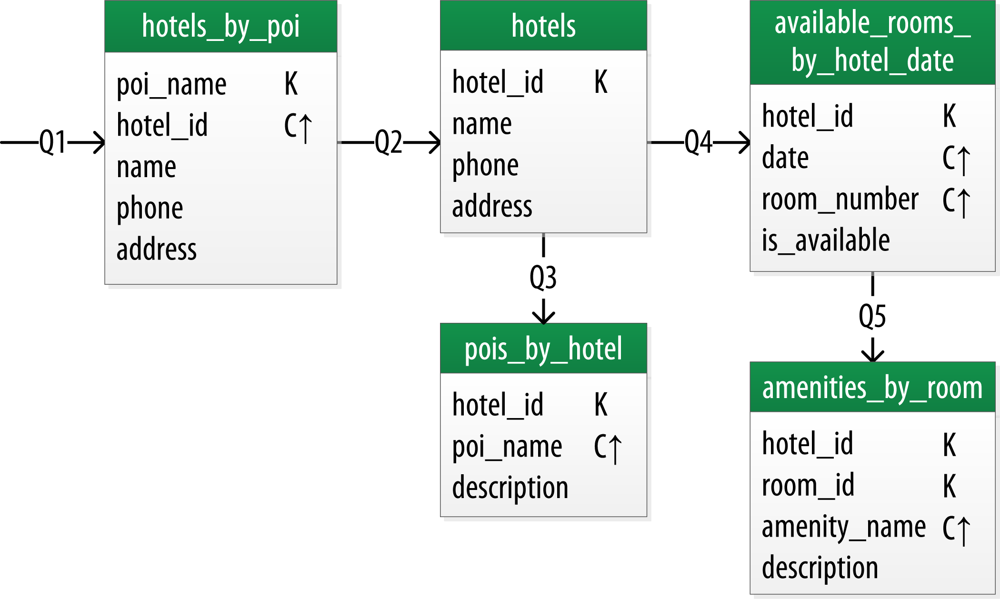
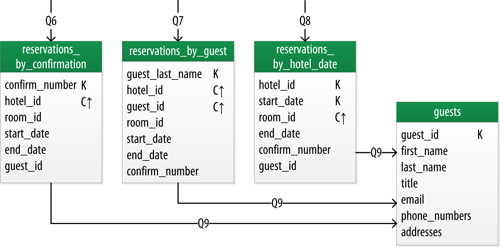

https://learning.oreilly.com/library/view/cassandra-the-definitive/9781491933657/ch05.html

### Defining Application Queries
Let’s try the query-first approach to start designing the data model for our hotel application. The user interface design for the application is often a great artifact to use to begin identifying queries. Let’s assume that we’ve talked with the project stakeholders and our UX designers have produced user interface designs or wireframes for the key use cases. 

#### We’ll likely have a list of shopping queries like the following:

Q1. Find hotels near a given point of interest. \
Q2. Find information about a given hotel, such as its name and location. \
Q3. Find points of interest near a given hotel. \
Q4. Find an available room in a given date range. \
Q5. Find the rate and amenities for a room. \

#### TIP:
NUMBER YOUR QUERIES \
It is often helpful to be able to refer to queries by a shorthand number rather that explaining them in full. The queries listed here are numbered Q1, Q2, and so on, which is how we will reference them in diagrams as we move throughout our example.

Now if our application is to be a success, we’ll certainly want our customers to be able to book reservations at our hotels. This includes steps such as selecting an available room and entering their guest information. So clearly we will also need some queries that address the reservation and guest entities from our conceptual data model. Even here, however, we’ll want to think not only from the customer perspective in terms of how the data is written, but also in terms of how the data will be queried by downstream use cases.

Our natural tendency as data modelers would be to focus first on designing the tables to store reservation and guest records, and only then start thinking about the queries that would access them. You may have felt a similar tension already when we began discussing the shopping queries before, thinking “but where did the hotel and point of interest data come from?” Don’t worry, we will get to this soon enough. 

### Here are some queries that describe how our users will access reservations:

Q6. Lookup a reservation by confirmation number. \
Q7. Lookup a reservation by hotel, date, and guest name. \
Q8. Lookup all reservations by guest name. \
Q9. View guest details. \

We show all of our queries in the context of the workflow of our application in Figure 5-3. Each box on the diagram represents a step in the application workflow, with arrows indicating the flows between steps and the associated query. If we’ve modeled our application well, each step of the workflow accomplishes a task that “unlocks” subsequent steps. For example, the “View hotels near POI” task helps the application learn about several hotels, including their unique keys. The key for a selected hotel may be used as part of Q2, in order to obtain detailed description of the hotel. The act of booking a room creates a reservation record that may be accessed by the guest and hotel staff at a later time through various additional queries.

### Logical Data Modeling
Now that we have defined our queries, we’re ready to begin designing our Cassandra tables. First, we’ll create a logical model containing a table for each query, capturing entities and relationships from the conceptual model.

To name each table, we’ll identify the primary entity type for which we are querying and use that to start the entity name. If we are querying by attributes of other related entities, we append those to the table name, separated with _by_. For example, hotels_by_poi.

Next, we identify the primary key for the table, adding partition key columns based on the required query attributes, and clustering columns in order to guarantee uniqueness and support desired sort ordering.

We complete each table by adding any additional attributes identified by the query. If any of these additional attributes are the same for every instance of the partition key, we mark the column as static.

### Hotel Logical Data Model
Figure 5-5 shows a Chebotko logical data model for the queries involving hotels, points of interest, rooms, and amenities. One thing we notice immediately is that our Cassandra design doesn’t include dedicated tables for rooms or amenities, as we had in the relational design. This is because our workflow didn’t identify any queries requiring this direct access.

### Let’s explore the details of each of these tables.

1) 

Our first query Q1 is to find hotels near a point of interest, so we’ll call our table hotels_by_poi. We’re searching by a named point of interest, so that is a clue that the point of interest should be a part of our primary key. Let’s reference the point of interest by name, because according to our workflow that is how our users will start their search.

You’ll note that we certainly could have more than one hotel near a given point of interest, so we’ll need another component in our primary key in order to make sure we have a unique partition for each hotel. So we add the hotel key as a clustering column.

### MAKE YOUR PRIMARY KEYS UNIQUE 
***An important consideration in designing your table’s primary key is making sure that it defines a unique data element. Otherwise you run the risk of accidentally overwriting data.***

2) 

Now for our second query (Q2), we’ll need a table to get information about a specific hotel. One approach would have been to put all of the attributes of a hotel in the hotels_by_poi table, but we chose to add only those attributes that were required by our application workflow.

From our workflow diagram, we know that the hotels_by_poi table is used to display a list of hotels with basic information on each hotel, and the application knows the unique identifiers of the hotels returned. When the user selects a hotel to view details, we can then use Q2, which is used to obtain details about the hotel. Because we already have the hotel_id from Q1, we use that as our reference to the hotel we’re looking for. Therefore our second table is just called hotels.

Another option would have been to store a set of poi_names in the hotels table. This is an equally valid approach. You’ll learn through experience which approach is best for your application.

3) 

Q3 is just a reverse of Q1—looking for points of interest near a hotel, rather than hotels near a point of interest. This time, however, we need to access the details of each point of interest, as represented by the pois_by_hotel table. As we have done previously, we add the point of interest name as a clustering key to guarantee uniqueness.

4) 

At this point, let’s now consider how to support query Q4 to help our user find available rooms at a selected hotel for the nights they are interested in staying. Note that this query involves both a start date and an end date. Because we’re querying over a range instead of a single date, we know that we’ll need to use the date as a clustering key. We use the hotel_id as a primary key to group room data for each hotel on a single partition, which should help our search be super fast. Let’s call this the available_rooms_by_hotel_date table.

### SEARCHING OVER A RANGE
***Use clustering columns to store attributes that you need to access in a range query. Remember that the order of the clustering columns is important.***

5) 

In order to round out the shopping portion of our data model, we add the amenities_by_room table to support Q5.  This will allow our user to view the amenities of one of the rooms that is available for the desired stay dates.

### Reservation Logical Data Model
Now we switch gears to look at the reservation queries. Figure 5-6 shows a logical data model for reservations. You’ll notice that these tables represent a denormalized design; the same data appears in multiple tables, with differing keys. 

